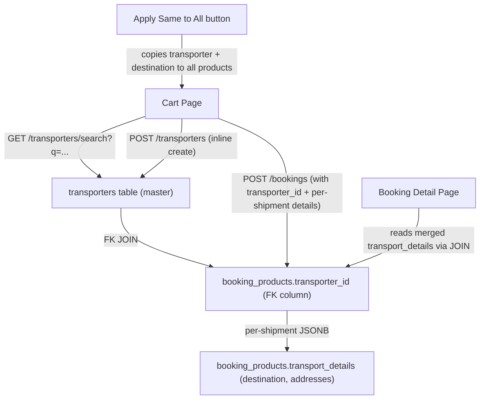

# Transport Details Feature — Implementation Plan

## Goal

When a salesman opts for transportation during booking, allow entering **per-product** transport details (destination, transporter, bus number, driver mobile). Transporters are a reusable master entity (like Users/Vendors) with full CRUD, search/autocomplete, and inline creation.

---

## Architecture Overview



### Data Flow

1. **Transporter** = reusable master record (name, phone, bus_no) — stored in `transporters` table
2. **Transport Details** = split across two columns on `booking_products`:
   - `transporter_id` (FK column) → JOINed with `transporters` for `name`, `phone`, `bus_no`
   - `transport_details` (JSONB) → per-shipment fields only: `destination`, `source_address`, `destination_address`, `destination_phone`
3. **Transport Charge** = booking-level amount (₹) — stays on `bookings.transport_charge` (no change)

> [!IMPORTANT]
> Master transporter fields (name, phone, bus_no) are **NOT snapshotted** — they come from a JOIN with the `transporters` table, ensuring updates to a transporter's info are reflected everywhere. Only per-shipment fields (destination, addresses) are stored in JSONB.

---

## Proposed Changes

### Database

#### [NEW] [052_create_transporters_table.sql](file:///c:/Users/User/Documents/app/backend/src/database/migrations/052_create_transporters_table.sql)

```sql
-- Migration 052: Create transporters table and add transport columns to booking_products

-- 1. Create transporters master table
CREATE TABLE IF NOT EXISTS transporters (
  id SERIAL PRIMARY KEY,
  name VARCHAR(255) NOT NULL,
  phone VARCHAR(20) NOT NULL,
  phone_country VARCHAR(5) DEFAULT 'IN',
  bus_no VARCHAR(50),
  notes VARCHAR(255),
  is_deleted BOOLEAN DEFAULT FALSE,
  created_at TIMESTAMP DEFAULT CURRENT_TIMESTAMP,
  updated_at TIMESTAMP DEFAULT CURRENT_TIMESTAMP
);

-- 2. Add transport columns to booking_products
ALTER TABLE booking_products
  ADD COLUMN IF NOT EXISTS transporter_id INTEGER REFERENCES transporters(id),
  ADD COLUMN IF NOT EXISTS transport_details JSONB DEFAULT NULL;

COMMENT ON COLUMN booking_products.transporter_id IS
  'FK to transporters table — master fields (name, phone, bus_no) come from JOIN.';
COMMENT ON COLUMN booking_products.transport_details IS
  'Per-shipment JSONB: {destination, source_address, destination_address, destination_phone}. NULL = no transport.';
```

**JSONB shape** stored in `booking_products.transport_details` (per-shipment only):
```json
{
  "destination": "Rajkot, Gujarat",
  "source_address": "Station Road Office",
  "destination_address": "Main Road Office",
  "destination_phone": "9876543210"
}
```

**Master fields** (from `transporters` table via JOIN, NOT in JSONB):
- `transporter_id` → `transporters.id`
- `transporter_name` → `transporters.name`
- `phone` → `transporters.phone`
- `bus_no` → `transporters.bus_no`
```

---

### Backend — Transporter Service (NEW)

#### [NEW] [transporterService.js](file:///c:/Users/User/Documents/app/backend/src/services/transporterService.js)

Follows the exact same pattern as [vendorService.js](file:///c:/Users/User/Documents/app/backend/src/services/vendorService.js):

| Method | Description |
|--------|-------------|
| `listTransporters({ search })` | List all non-deleted transporters, optional search by name/phone |
| `searchTransporters(query)` | Autocomplete — min 2 chars, returns top 10 matches by name. **Used in cart for quick-fill** |
| `getTransporterById(id)` | Get single transporter by ID |
| `createTransporter({ name, phone, phone_country, bus_no, notes })` | Create new transporter. Validates: name and phone required, phone length via `validatePhoneLength()` |
| `updateTransporter(id, data)` | Update mutable fields (name, phone, bus_no, notes). Guarded: cannot update deleted transporter |
| `deleteTransporter(id)` | Soft-delete (set `is_deleted = TRUE`). No FK guards needed since booking_products stores a JSONB snapshot |

---

### Backend — Transporter Route (NEW)

#### [NEW] [transporters.js](file:///c:/Users/User/Documents/app/backend/src/routes/transporters.js)

Follows the exact same pattern as [vendors.js](file:///c:/Users/User/Documents/app/backend/src/routes/vendors.js):

| Endpoint | Handler |
|----------|---------|
| `GET /api/transporters` | List all (optional `?search=`) |
| `GET /api/transporters/search?q=<name>` | Autocomplete (min 2 chars) |
| `GET /api/transporters/:id` | Get by ID |
| `POST /api/transporters` | Create new |
| `PUT /api/transporters/:id` | Update |
| `DELETE /api/transporters/:id` | Soft-delete |

---

### Backend — Route Permissions

#### [MODIFY] [routePermissions.js](file:///c:/Users/User/Documents/app/backend/src/middleware/routePermissions.js)

Add transporters to the shared routes (any authenticated user — salesman needs to search/create transporters during booking):

```diff
 // Shared (any authenticated user)
+'/api/transporters':      'transporters',
```

---

### Backend — Booking Service

#### [MODIFY] [bookingService.js](file:///c:/Users/User/Documents/app/backend/src/services/bookingService.js)

**`createBooking()`** — Accept `transportDetails` per product and store in `booking_products`:

```diff
 for (const product of products) {
   const {
     productId, bookedFrom, bookedTo, rent, securityDeposit,
     size, quantity, measurements, specialRequirements,
-    discountType, discountValue
+    discountType, discountValue, transportDetails
   } = product;

   // ... existing validation ...

   const bpResult = await client.query(
     `INSERT INTO booking_products (
       booking_id, product_id, quantity, booked_from, booked_to,
       status, rent, security_deposit, effective_rent,
       discount_amount, discount_type,
-      measurements, special_requirements, size
-    ) VALUES ($1,$2,$3,$4,$5,$6,$7,$8,$9,$10,$11,$12,$13,$14)
+      measurements, special_requirements, size, transport_details
+    ) VALUES ($1,$2,$3,$4,$5,$6,$7,$8,$9,$10,$11,$12,$13,$14,$15)
     RETURNING id`,
     [
       bookingId, productId, quantity, bookedFrom, bookedTo,
       'pending', rent, securityDeposit, effectiveRent,
       discountAmount, discountType || null,
-      measurements ? JSON.stringify(measurements) : null, specialRequirements || null, size || null
+      measurements ? JSON.stringify(measurements) : null, specialRequirements || null, size || null,
+      transportDetails ? JSON.stringify(transportDetails) : null
     ]
   );
```

**`getBookingById()`** — Include `bp.transport_details` in the products JSON aggregate:

```diff
 json_agg(
   json_build_object(
     ...existing fields...,
+    'transport_details', bp.transport_details
   )
 )
```

**`getBookingsList()`** — Include `bp.transport_details` in the products JSON aggregate:

```diff
 json_agg(
   DISTINCT jsonb_build_object(
     ...existing fields...,
+    'transport_details', bp.transport_details
   )
 )
```

**`updateBooking()`** — Allow updating `transport_details` on individual booking products (e.g. when driver/bus changes before dispatch):

Add a new section (similar to measurements/special_requirements update):
```javascript
// ── Transport details update ──
if (data.transport_details) {
  // transport_details is keyed by booking_product_id
  for (const [bpId, details] of Object.entries(data.transport_details)) {
    if (!validBpIds.has(parseInt(bpId))) continue;
    await client.query(
      'UPDATE booking_products SET transport_details = $1 WHERE id = $2 AND booking_id = $3',
      [JSON.stringify(details), parseInt(bpId), bookingId]
    );
  }
}
```

---

### Backend — Bookings Route

#### [MODIFY] [bookings.js](file:///c:/Users/User/Documents/app/backend/src/routes/bookings.js)

In `POST /` — pass through `transport_details` from each product in `req.body.products`:

```diff
 return {
   productId,
   bookedFrom: p.booked_from,
   bookedTo: p.booked_to,
   rent: ProductService.getProductRent(productDetails, size),
   securityDeposit: productDetails.security_deposit,
   size,
   quantity: p.quantity || 1,
   measurements: p.measurements,
   specialRequirements: p.special_requirements,
   discountType: p.discountType || null,
-  discountValue: p.discountValue || 0
+  discountValue: p.discountValue || 0,
+  transportDetails: p.transport_details || null
 };
```

---

### Shared Types

#### [MODIFY] [index.ts](file:///c:/Users/User/Documents/app/shared/src/types/index.ts)

Add new types:

```typescript
// Transporter (master record for transport providers)
export interface Transporter {
  id: number;
  name: string;
  phone: string;
  phone_country: string;
  bus_no?: string;
  notes?: string;
  is_deleted?: boolean;
  created_at: string;
  updated_at: string;
}

// Transport details snapshot (stored per booking_product)
export interface TransportDetails {
  transporter_id?: number;
  transporter_name?: string;
  phone?: string;
  bus_no?: string;
  destination?: string;
}
```

Update `BookingProduct` interface:

```diff
 export interface BookingProduct {
   // ...existing fields...
+  transport_details?: TransportDetails | null;
 }
```

---

### Shared API Client

#### [NEW] [transporters.ts](file:///c:/Users/User/Documents/app/shared/src/api/transporters.ts)

Follows exact same pattern as [vendors.ts](file:///c:/Users/User/Documents/app/shared/src/api/vendors.ts):

```typescript
import { AxiosInstance } from 'axios';
import { Transporter } from '../types';

export function createTransportersApi(api: AxiosInstance) {
  return {
    getAll: (params?: { search?: string }) =>
      api.get<Transporter[]>('/transporters', { params }),
    search: (query: string) =>
      api.get<Transporter[]>(`/transporters/search?q=${encodeURIComponent(query)}`),
    getById: (id: number) =>
      api.get<Transporter>(`/transporters/${id}`),
    create: (data: Omit<Transporter, 'id' | 'created_at' | 'updated_at'>) =>
      api.post<Transporter>('/transporters', data),
    update: (id: number, data: Partial<Transporter>) =>
      api.put<Transporter>(`/transporters/${id}`, data),
    delete: (id: number) =>
      api.delete(`/transporters/${id}`),
  };
}
```

#### [MODIFY] [index.ts](file:///c:/Users/User/Documents/app/shared/src/api/index.ts)

Register `transporters` in `createApi()` and the `Api` interface. Add import and export for `createTransportersApi`.

---

### Frontend API

#### [MODIFY] [api.ts](file:///c:/Users/User/Documents/app/frontend/lib/api.ts)

```diff
+export const transportersApi = api.transporters;
```

Add to re-exports:
```diff
+export type { Transporter, TransportDetails } from '@rental/shared';
```

---

### Frontend — Cart Page

#### [MODIFY] [page.tsx](file:///c:/Users/User/Documents/app/frontend/app/(authenticated)/cart/page.tsx)

When `transportationRequired === 'yes'`, show per-product transport details:

**New state variables:**
```typescript
// Per-product transport state: keyed by cart item index
const [productTransportDetails, setProductTransportDetails] = useState<Record<number, {
  transporter_id?: number;
  transporter_name: string;
  phone: string;
  bus_no: string;
  destination: string;
}>>({});

// Transporter search state (per-product, like phone search for users)
const [transporterSearchQuery, setTransporterSearchQuery] = useState<Record<number, string>>({});
const [transporterSearchResults, setTransporterSearchResults] = useState<Transporter[]>([]);
const [showTransporterDropdown, setShowTransporterDropdown] = useState<number | null>(null);
const transporterSearchTimerRef = useRef<ReturnType<typeof setTimeout> | null>(null);
```

**New UI for each product card** (inside the cart items loop, when transport is "Yes"):

```
📦 Product: Lehenga (SH-001)
├── 🔍 Search Transporter: [_____________] ← autocomplete dropdown (like phone search)
│   └── dropdown shows: "Rajdhani Transport (9876543210)" | "+ Add New Transporter"
├── Transport Name: [auto-filled from selection]
├── Bus No: [auto-filled from selection]  
├── Driver Mobile: [auto-filled from selection]
├── 📍 Destination: [_____________] ← manual entry (unique per booking)
└── [Apply Same to All] button
```

**Transporter search function** (mirrors `handlePhoneSearch`):
```typescript
function handleTransporterSearch(query: string, productIndex: number) {
  if (transporterSearchTimerRef.current) clearTimeout(transporterSearchTimerRef.current);
  if (query.length < 2) {
    setTransporterSearchResults([]);
    setShowTransporterDropdown(null);
    return;
  }
  transporterSearchTimerRef.current = setTimeout(async () => {
    const res = await transportersApi.search(query);
    setTransporterSearchResults(res.data || []);
    setShowTransporterDropdown(productIndex);
  }, 350);
}
```

**Transporter select** (mirrors `handleUserSelect`):
```typescript
function handleTransporterSelect(transporter: Transporter, productIndex: number) {
  setProductTransportDetails(prev => ({
    ...prev,
    [productIndex]: {
      ...prev[productIndex],
      transporter_id: transporter.id,
      transporter_name: transporter.name,
      phone: transporter.phone,
      bus_no: transporter.bus_no || '',
      destination: prev[productIndex]?.destination || '',
    }
  }));
  setShowTransporterDropdown(null);
}
```

**"+ Add New Transporter" inline creation** (mirrors user creation in Path B):
```typescript
async function handleCreateTransporter(productIndex: number) {
  const details = productTransportDetails[productIndex];
  const res = await transportersApi.create({
    name: details.transporter_name,
    phone: details.phone,
    phone_country: 'IN',
    bus_no: details.bus_no,
  });
  // Update with the created transporter's ID
  setProductTransportDetails(prev => ({
    ...prev,
    [productIndex]: { ...prev[productIndex], transporter_id: res.data.id }
  }));
}
```

**"Apply Same to All" button**:
```typescript
function applyTransportToAll(sourceIndex: number) {
  const source = productTransportDetails[sourceIndex];
  if (!source) return;
  const updated: Record<number, typeof source> = {};
  cartItems.forEach((_, i) => { updated[i] = { ...source }; });
  setProductTransportDetails(updated);
}
```

**Booking creation** — include `transport_details` per product:
```diff
 products: cartItems.map((item, index) => ({
   id: item.product.id,
   booked_from: item.dateFrom,
   booked_to: item.dateTo,
   size: item.size || null,
   discountType: item.discountType || null,
   discountValue: item.discountValue || 0,
+  transport_details: transportationRequired === 'yes' 
+    ? productTransportDetails[index] || null 
+    : null,
 })),
```

---

### Frontend — Bookings List Page

#### [MODIFY] [page.tsx](file:///c:/Users/User/Documents/app/frontend/app/(authenticated)/bookings/page.tsx)

Update the "🚚 Local Transportation Opted" indicator (lines 758-769) to show transport details per product when available:

```
🚚 Local Transportation Opted — ₹2,000
   📦 Lehenga → Rajkot via Rajdhani Transport (Bus: GJ-05-1234)
   📦 Sherwani → Ahmedabad via Patel Travels (Bus: GJ-11-5678)
```

---

### Frontend — Booking Detail Page

#### [MODIFY] [page.tsx](file:///c:/Users/User/Documents/app/frontend/app/(authenticated)/bookings/[id]/page.tsx)

For each product card, if `transport_details` exists, show:

```
📍 Transport: Rajdhani Transport → Rajkot
   Bus: GJ-05-1234 | Driver: 9876543210
```

Allow editing transport details for pending/confirmed bookings (calls `PUT /bookings/:id` with `transport_details` keyed by booking_product_id).

---

## New Files Summary

| File | Layer | Mirrors |
|------|-------|---------|
| `backend/src/database/migrations/052_create_transporters_table.sql` | DB | `027_create_vendors_table.sql` |
| `backend/src/services/transporterService.js` | Service | `vendorService.js` |
| `backend/src/services/transporterService.test.js` | Test | `vendorService.test.js` |
| `backend/src/routes/transporters.js` | Route | `vendors.js` |
| `backend/src/routes/transporters.test.js` | Test | `vendors.test.js` |
| `shared/src/api/transporters.ts` | API Client | `vendors.ts` |

## Modified Files Summary

| File | Change |
|------|--------|
| `backend/src/middleware/routePermissions.js` | Add `/api/transporters` |
| `backend/src/services/bookingService.js` | Accept & store `transport_details` per product; include in queries |
| `backend/src/routes/bookings.js` | Pass through `transport_details` per product |
| `shared/src/types/index.ts` | Add `Transporter`, `TransportDetails` types; update `BookingProduct` |
| `shared/src/api/index.ts` | Register `transporters` API |
| `frontend/lib/api.ts` | Export `transportersApi` and types |
| `frontend/app/(authenticated)/cart/page.tsx` | Per-product transport form with search, inline create, apply-all |
| `frontend/app/(authenticated)/bookings/page.tsx` | Show transport details in booking indicator |
| `frontend/app/(authenticated)/bookings/[id]/page.tsx` | Show/edit transport details per product |

---

## Verification Plan

### Automated Tests

#### New: `transporters.test.js` (route-level integration tests)

| Test | Assertion |
|------|-----------|
| `POST /transporters` — create with valid data | 201, returns transporter with id |
| `POST /transporters` — missing name | 400 |
| `POST /transporters` — missing phone | 400 |
| `POST /transporters` — invalid phone length for country | 400 |
| `GET /transporters` — list all | 200, array |
| `GET /transporters?search=...` — filter by name/phone | 200, filtered results |
| `GET /transporters/search?q=...` — autocomplete | 200, matching results |
| `GET /transporters/search?q=A` — too short | 400 |
| `GET /transporters/:id` — existing | 200, correct transporter |
| `GET /transporters/:id` — non-existent | 404 |
| `PUT /transporters/:id` — update name/bus_no | 200, updated fields |
| `PUT /transporters/:id` — no fields | 400 |
| `DELETE /transporters/:id` — soft-delete | 200, is_deleted = true |
| `DELETE /transporters/:id` — non-existent | 404 |

#### New: `transporterService.test.js` (service-level unit tests)

All service methods tested with direct DB assertions (same pattern as `vendorService.test.js`).

#### Existing: `bookings.test.js` — extend with transport tests

| Test | Assertion |
|------|-----------|
| `POST /bookings` with `transport_details` per product | 201, transport_details saved in DB |
| `GET /bookings/:id` returns `transport_details` in products | products[].transport_details present |
| `PUT /bookings/:id` with `transport_details` update | transport_details updated for specified booking_product_id |
| `POST /bookings` without `transport_details` | 201, transport_details is null (backward compatible) |

#### Existing: `bookingService.test.js` — extend

| Test | Assertion |
|------|-----------|
| `createBooking()` with transportDetails per product | JSONB stored correctly |
| `getBookingById()` returns transport_details | Present in response |
| `updateBooking()` with transport_details | Updated correctly |

### Regression Checks

- Run full existing test suite: `npm test` — all existing tests must pass unchanged
- Specifically verify:
  - Booking creation without transport details still works (null default)
  - Payment summary calculations unaffected
  - Invoice generation unaffected
  - Product lifecycle (pickup/return/exchange/cancel) unaffected
  - Booking list queries still performant

### Manual Verification

1. **Cart → No transport**: Create booking without transport → verify `transport_details` is null
2. **Cart → Transport + single destination**: Select "Yes", search transporter, fill destination → create booking → verify saved
3. **Cart → Transport + different destinations**: Fill different transporters per product → verify each product has correct details
4. **Cart → Apply Same to All**: Fill one product, click button → verify all products get same details
5. **Cart → New transporter inline**: Type name that doesn't exist → click "+ Add New" → verify transporter created and selected
6. **Booking detail → View**: Open booking → verify transport details show per product
7. **Booking detail → Edit**: Change bus number → save → verify updated
8. **Bookings list → Indicator**: Verify "🚚" indicator shows destinations
